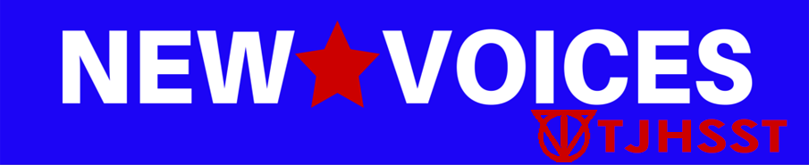

# Solution

Create an 8th period to work with organizations to combat censorship. The club would work with the Student Press Law center to pass a speech protection bill in Virginia, and would work with the Electonic Frontiers Foundation and Freedom to Read organization on other activities.

# Goals

Advocate for a law promoting “Students’ right to determine the news, opinion, feature, and advertising content of the media…” in Virginia schools similar to Maryland's Senate Bill 764 by cooperating with with the SPLC.

# Action Plan

* Sep-Nov: Draft a bill based on similar ones from Maryland and Illinois
* Dec-Jan: Garner support for the bill by petitioning representatives
* Jan-Feb: Propose bill to Virginia General Assembly
* Mar-Apr: Meet with VA Board of Education to discuss implementation
* Future plans: Electronic Frontiers Foundation activities

